<picture>
  <source media="(prefers-color-scheme: dark)" srcset="./assets/profile-dark.svg">
  <source media="(prefers-color-scheme: light)" srcset="./assets/profile-light.svg">
  
</picture>

  
  

<h3 align="center">A bit about me</h3>

I tend to choose the simplest approach that actually works. That means moving quickly when a decision is cheap, slowing down when mistakes are expensive, and leaving enough room to change course later.

I care about finishing things, but not at the cost of making tomorrow harder than it needs to be. What deserves extra time depends on the problem.

<h3 align="center">Where things get interesting</h3>

I like the moment when something complicated starts to feel simple. Not simplified by ignoring the awkward parts, but made understandable because the awkward parts have been worked through.

<table>
  <tr>
    <td width="33%" valign="top">
      <h3>Business logic</h3>
      APIs are rarely the hard part. The real work is in the exceptions, handoffs, conflicting rules, missing information, and the gap between the documented process and what people actually do.
    </td>
    <td width="33%" valign="top">
      <h3>Applied AI</h3>
      The demo is usually easy. Things get interesting when the model has to be useful inside a real workflow, with sensible guardrails, clear failure states, and a reason to be there.
    </td>
    <td width="33%" valign="top">
      <h3>The whole product</h3>
      Sometimes the simple answer only appears when product, UX, backend, data, infrastructure, integrations, and operations are treated as one problem instead of separate tickets.
    </td>
  </tr>
</table>

There is beauty in a system that feels obvious on the outside, even when a lot of careful thinking was required to make it feel that way.

<h3 align="center">Receipts</h3>

Most of my work lives in private repositories, so GitHub only tells part of the story. These visuals refresh every night, and the streak includes private contribution counts.

  

<picture>
  <source media="(prefers-color-scheme: dark)" srcset="https://raw.githubusercontent.com/OskaraOskar/OskaraOskar/output/github-contribution-grid-snake-dark.svg">
  <source media="(prefers-color-scheme: light)" srcset="https://raw.githubusercontent.com/OskaraOskar/OskaraOskar/output/github-contribution-grid-snake.svg">
  
</picture>

If you ever see 212 commits in one day: rebase and squash, my friend. Rebase and squash.

<h3 align="center">Toolbox</h3>

These are the tools I reach for most often, not the edge of what I know. I have learned and experimented with plenty of others, from Solidity to building my own basic AI system years ago.

If a problem calls for something else, I am comfortable learning it.

<strong>Languages</strong>

  
  &nbsp;
  
  &nbsp;
  
  &nbsp;
  
  &nbsp;
  

<strong>Products and platforms</strong>

  
  &nbsp;
  
  &nbsp;
  
  &nbsp;
  
  &nbsp;
  
  &nbsp;
  

<strong>Tools</strong>

  
  &nbsp;
  <picture>
    <source media="(prefers-color-scheme: dark)" srcset="https://cdn.simpleicons.org/github/f5f5f5">
    <source media="(prefers-color-scheme: light)" srcset="https://cdn.simpleicons.org/github/181717">
    
  </picture>
  &nbsp;
  
  &nbsp;
  
  &nbsp;
  

<h3 align="center">Say hello</h3>

I am based in Copenhagen and work on Europe/Stockholm time. The easiest way to reach me is [LinkedIn](https://www.linkedin.com/in/oskar-arnetz/). A short message with a little context is plenty.
